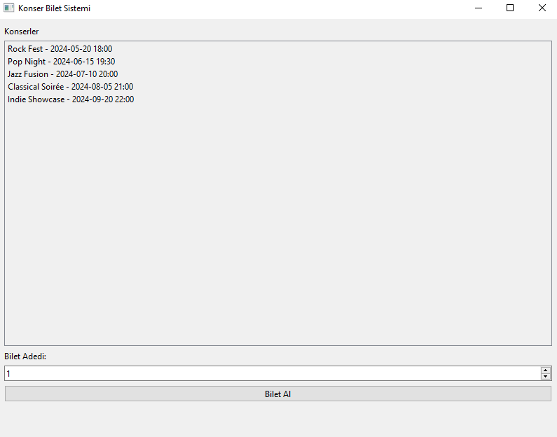
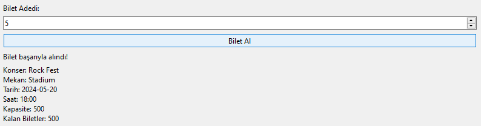

# Konser Bilet Sistemi

Bu program, kullanıcıların çeşitli konserlere bilet satın almasına ve konserler hakkında bilgi almasına olanak tanır. Kullanıcılar, mevcut konserleri listeleyebilir, istedikleri bir konser için bilet adedini belirleyebilir ve bilet satın alabilirler.

## Konser Listesi:

Kullanıcı, mevcut konserlerin bir listesini görür. Her konser, adıyla birlikte tarih ve saat bilgilerini içerir.

## Konser Seçme:

Kullanıcı, listelenen konserlerden birini seçer.

## Bilet Adedi Seçme:

Kullanıcı, seçilen konser için kaç adet bilet almak istediğini belirtir.

## Bilet Satın Alma:

Kullanıcı, "Bilet Al" düğmesine tıklayarak seçtiği konser için bilet satın alır.
Bu program, kullanıcıların konserlere kolayca erişim sağlamasını ve bilet satın almasını sağlar, böylece müzikseverlerin etkinliklere katılmasını kolaylaştırır.

